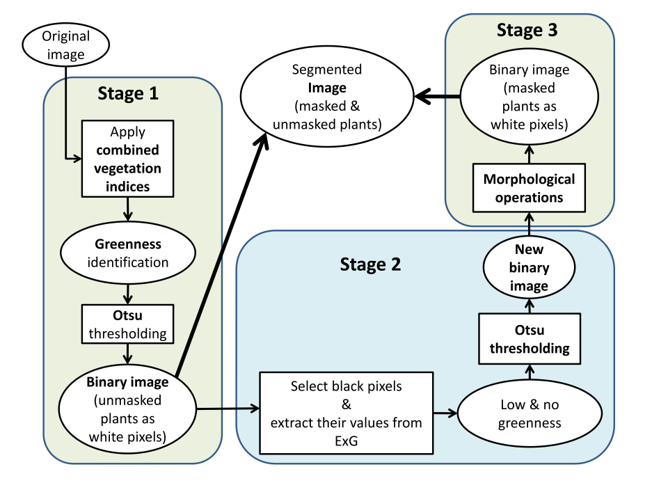
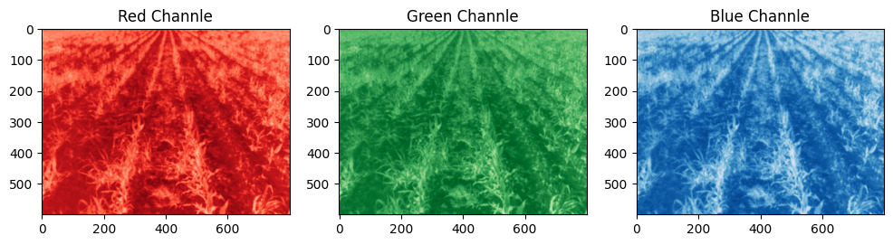
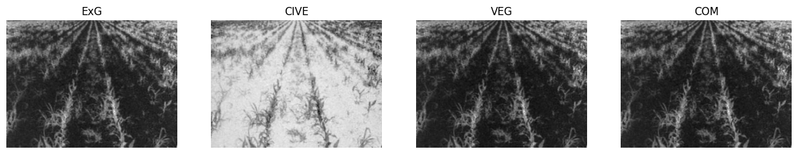
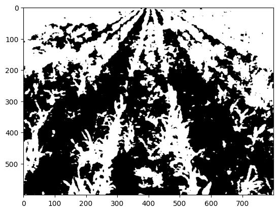
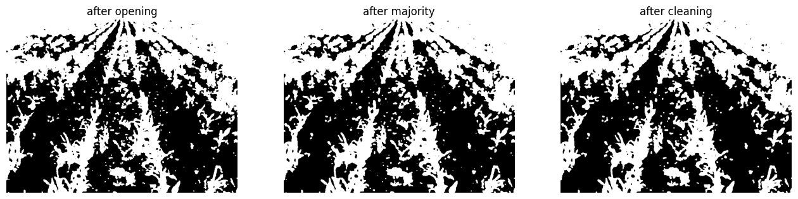
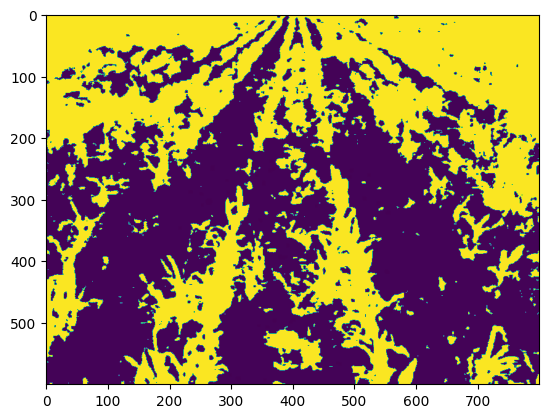

# Implementing AES article

This article is about applying an algorithm on an image in order to segment weeds and crops in an image. since implementing segmentation neural networks such as ```U-Net``` need expensive hardware such as ```GPUs```, in this article a new algorithm was introduced to reduce hardware expenses. 

In the following the stages of algorithm will be shown:



as you can see, the procedure has 3 stages and each stage each is consist of image processing operations.

## Stage 1

first we have to extract ExG(Excess Green) from the input image and we should do this once the RGB channels are separated and normalized.



then by using the formulas which are mentioned at the article, we will make ExG, VEG, CIVE and COM images:



once we make COM image, we will apply ```OTSU_Binary_thresholding``` function on it:




## Stage 2

After making binary mask in precious stage, we will go through 2nd stage, and we should use the mask and ExG image to apply an ```OTSU_Binary_thresholding``` on the pixels of ExG which have the value zero in the mask:


## Stage 3

At the final stage, we will apply morphological operations which are mentioned in the article one by one:



to make the final Image we should combine the binary image of the 1st stage and 3rd stage:

